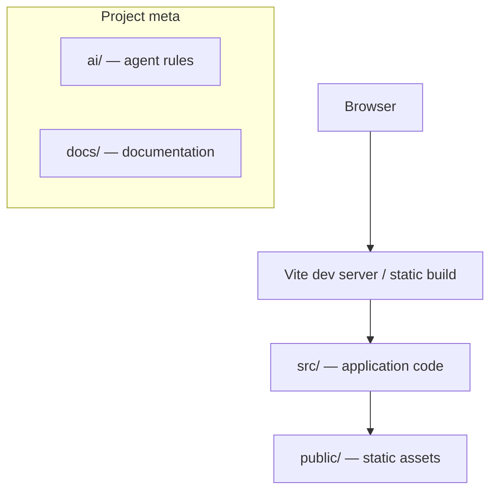

# Knowledge Map — {{projectName}}

The single starting point for understanding this codebase. **Agents: read this before
your first change in a session. Everyone: update it whenever project structure changes.**
Last updated: {{date}}.

## Documentation index

| Document | What it answers |
| --- | --- |
| [../AGENTS.md](../AGENTS.md) | Entry point for AI agents: commands, policies |
| [../ai/CONSTITUTION.md](../ai/CONSTITUTION.md) | Non-negotiable principles for agents |
| [../ai/AI_INSTRUCTIONS.md](../ai/AI_INSTRUCTIONS.md) | Agent workflow: before/during/after a task |
| [../ai/DOMAIN_RULES.md](../ai/DOMAIN_RULES.md) | Domain terminology, business rules, constraints |
| [ARCHITECTURE.md](ARCHITECTURE.md) | Stack, module boundaries, data flow |
| [DOCUMENTATION_GUIDE.md](DOCUMENTATION_GUIDE.md) | Doc granularity levels + when to update what |
| [adr/](adr/) | Architectural decision records (why things are the way they are) |
| [../README.md](../README.md) | Human-facing overview: what this project is, how to run it |

## Folder map

| Path | Purpose |
| --- | --- |
| `src/` | Application source (Vite `{{template}}` layout) |
| `public/` | Static assets served as-is |
| `ai/` | Rules governing AI agent behavior in this repo |
| `docs/` | All project documentation (you are here) |
| `docs/adr/` | Numbered architectural decision records |
{{extraFolderRows}}

> Keep this table in sync with reality. A folder that exists but isn't listed here —
> or vice versa — means this map is broken.

## Key concepts

<!-- As the project grows, list the 5-10 concepts someone must understand to work here,
each linking to where it lives in code. Seeded empty by Beemo. -->

- _None recorded yet — add the first one when the first real feature lands._

## Architecture at a glance

> Replace this diagram as real architecture emerges (components, state, services, APIs).
> Details belong in [ARCHITECTURE.md](ARCHITECTURE.md); this is the 10-second version.
